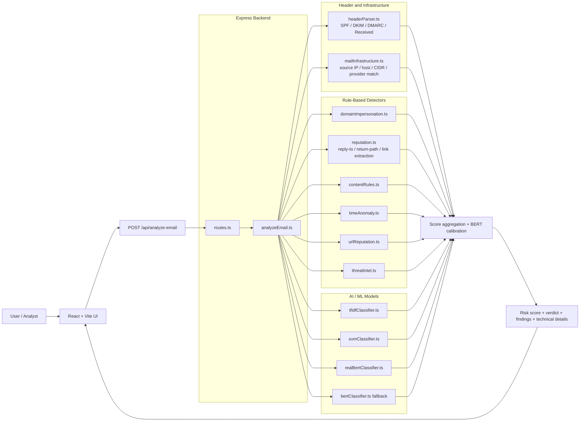
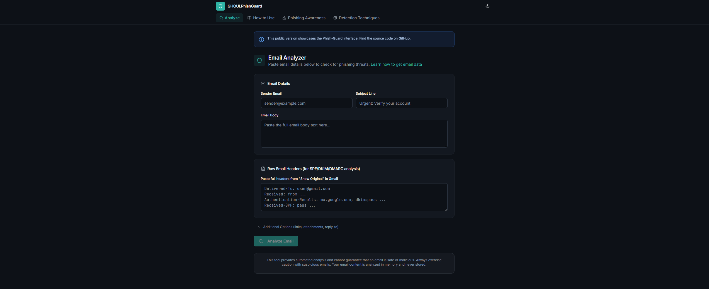
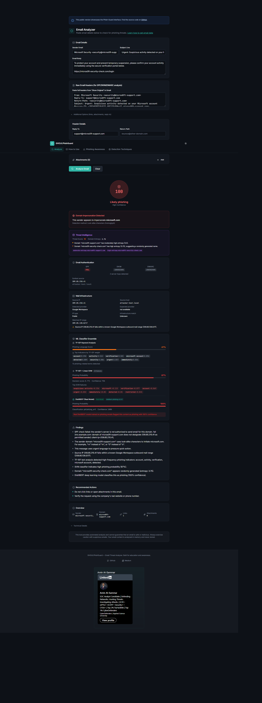
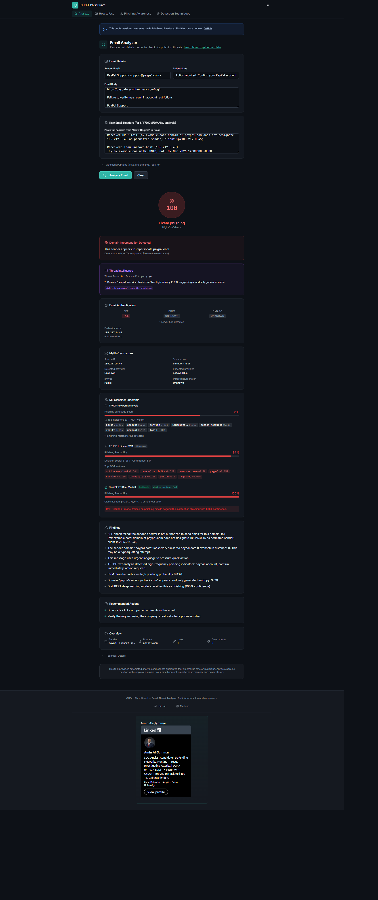
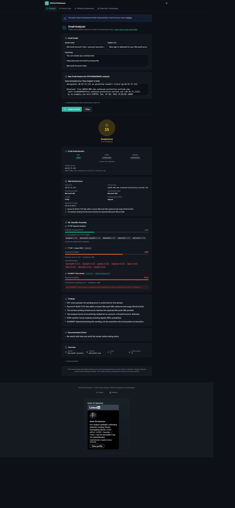
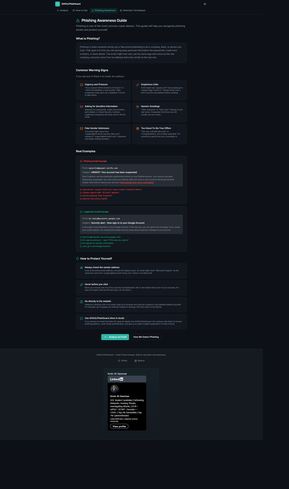

# GHOULPhishGuard

GHOULPhishGuard is an explainable phishing email analyzer built with React, Vite, Express, and TypeScript. It combines header analysis, infrastructure checks, URL and domain heuristics, and multiple AI/ML text classifiers to produce a 0-100 risk score with human-readable findings.

## Problem

Phishing detection is difficult for two reasons:

- many fake emails look legitimate at first glance
- many detection tools are either too shallow or too opaque

Most users only see the visible email body, while the strongest evidence often lives in:

- SPF, DKIM, and DMARC headers
- sender and reply-to mismatches
- infrastructure and IP ranges
- disguised or auto-extracted URLs
- subtle linguistic patterns

GHOULPhishGuard solves that by combining explainable security checks with AI-based text classification, then surfacing the result in a way that is useful for:

- phishing awareness
- security demos
- portfolio work
- manual email triage

## Demo

This repo is ready to run locally as a working demo.

After starting the app:

- UI: [http://127.0.0.1:5000](http://127.0.0.1:5000)
- Health: `GET /api/health`
- Model status: `GET /api/model-status`

### Local Demo Flow

1. Open the analyzer page.
2. Paste a sender, subject, body, and optional raw headers.
3. Submit the email to `/api/analyze-email`.
4. Review:
   - final risk score
   - findings
   - SPF/DKIM/DMARC details
   - infrastructure analysis
   - TF-IDF, SVM, and DistilBERT outputs

### Proof Of Concept Requests

#### 1. Check Model Status

```powershell
Invoke-RestMethod -Uri "http://127.0.0.1:5000/api/model-status"
```

Expected:

- `status: loaded` when the real DistilBERT model is active

#### 2. Brand Impersonation + Body URL Extraction

```powershell
$payload = @{
  fromEmail = "microsoft security <security@micros0ft-support.com>"
  subject = "Important: Security notification"
  bodyText = @"
Dear Amin,

We detected unusual activity associated with your Microsoft account.
Please confirm your account activity to prevent temporary restrictions.

https://micros0ft-security-check.com/login

If you do not complete verification within 12 hours, access may be limited.
"@
  replyTo = ""
  returnPath = ""
  rawHeaders = ""
  links = @()
  attachments = @()
  observedBrandDomains = @("microsoft.com")
} | ConvertTo-Json -Depth 5

Invoke-RestMethod `
  -Uri "http://127.0.0.1:5000/api/analyze-email" `
  -Method POST `
  -ContentType "application/json" `
  -Body $payload
```

Expected:

- domain impersonation detected
- body URL extracted even with `links = []`
- high-risk verdict driven by impersonation, urgency, heuristics, and ML signals

#### 3. Header And Infrastructure Mismatch

```powershell
$headers = @"
From: Microsoft Security <security@microsoft.com>
Authentication-Results: mx.example.com; spf=fail smtp.mailfrom=microsoft.com; dkim=fail header.d=microsoft.com header.s=selector1; dmarc=fail header.from=microsoft.com
Received-SPF: fail (mx.example.com: domain of microsoft.com does not designate 209.85.210.41 as permitted sender) client-ip=209.85.210.41; envelope-from=<security@microsoft.com>;
Received: from mail-ot1-f41.google.com (mail-ot1-f41.google.com [209.85.210.41]) by mx.example.com with ESMTPS; Sat, 07 Mar 2026 15:05:00 +0000
"@

$payload = @{
  fromEmail = ""
  subject = "Important security notice"
  bodyText = "Please verify your Microsoft account immediately."
  replyTo = ""
  returnPath = ""
  rawHeaders = $headers
  links = @()
  attachments = @()
  observedBrandDomains = @("microsoft.com")
} | ConvertTo-Json -Depth 5

Invoke-RestMethod `
  -Uri "http://127.0.0.1:5000/api/analyze-email" `
  -Method POST `
  -ContentType "application/json" `
  -Body $payload
```

Expected:

- SPF, DKIM, and DMARC failures
- source IP and source host extracted
- Google Workspace infrastructure detected
- mismatch between claimed Microsoft identity and actual sending provider

## Architecture

### High-Level Flow



### Main Components

- Frontend: React UI for input, results, techniques page, awareness page, and header collection guidance
- API: Express server exposing `/api/analyze-email`, `/api/model-status`, and `/api/health`
- Analysis orchestrator: `server/services/analyzeEmail.ts`
- Shared contract: `shared/schema.ts`

### Why This Architecture

- rule-based detectors provide explainability
- ML layers provide semantic coverage
- header parsing provides strong email-auth evidence
- infrastructure matching adds a network-level signal that content-only analyzers miss
- calibration reduces false positives when BERT is overconfident on benign security-related wording

## Detection Methods

This section matches the current implementation.

### Email Header Authentication

File: `server/services/headerParser.ts`

Parses:

- `Authentication-Results`
- `Received-SPF`
- `Received`

Extracts:

- SPF status
- DKIM status
- DMARC status
- `smtp.mailfrom`
- `header.d`
- `header.s`
- `header.from`
- hop count
- earliest source IP
- earliest source host

Checks:

- SPF / DKIM / DMARC failures
- alignment between visible `From` and authenticated domains
- unusual relay depth

### Mail Infrastructure And IP Range Analysis

File: `server/services/mailInfrastructure.ts`

Checks:

- source IP type
- provider-specific host patterns
- known outbound CIDR ranges
- provider mismatch between authenticated sender identity and actual source infrastructure

Current provider map includes:

- Microsoft 365
- Google Workspace
- Amazon SES
- SendGrid
- Mailchimp

### Domain Impersonation

File: `server/services/domainImpersonation.ts`

Methods:

- Levenshtein distance for typosquatting
- homoglyph detection
- brand name embedded in fake domains
- keyword-to-brand domain association

Examples:

- `paypa1.com`
- `micros0ft-support.com`
- `microsoft-login-alert.com`

### Link Extraction And Link Deception

Files:

- `server/services/reputation.ts`
- `server/services/analyzeEmail.ts`

Checks:

- auto-extract URLs from `bodyText`
- merge extracted URLs with manually supplied links
- compare visible URL text with actual destination
- identify brand-like hostnames resolving to another base domain

### Sender / Reply-To / Return-Path Mismatch

File: `server/services/reputation.ts`

Checks whether:

- `From` base domain differs from `Reply-To`
- `From` base domain differs from `Return-Path`

### Content Rules

File: `server/services/contentRules.ts`

Rule categories:

- urgency
- emotional pressure
- sensitive information requests
- abuse of trusted platforms like Google Forms, SharePoint, Notion, and Dropbox

### Attachment Risk Checks

Implemented in: `server/services/analyzeEmail.ts`

Flags risky extensions:

- `.zip`
- `.exe`
- `.js`
- `.iso`
- `.html`
- `.docm`
- `.xlsm`
- `.scr`

### Time-of-Day Anomaly Detection

File: `server/services/timeAnomaly.ts`

Flags:

- unusual send time between `01:00` and `05:00 UTC`
- stronger weekend late-night anomaly

### URL Reputation

File: `server/services/urlReputation.ts`

Checks:

- RDAP domain age
- suspicious TLDs
- free-hosting platforms

Age scoring:

- `< 7 days` -> `+15`
- `< 30 days` -> `+10`
- `< 90 days` -> `+5`

### Threat-Intel Heuristics

File: `server/services/threatIntel.ts`

Checks:

- high-entropy domains
- phishing naming patterns
- shorteners
- free-hosting indicators
- excessive subdomains
- raw-IP URLs
- homograph and punycode domains
- optional Google Safe Browsing hits

## AI Models Used

### 1. TF-IDF Keyword Scoring

File: `server/services/tfidfClassifier.ts`

This is a handcrafted weighted phishing lexicon.

How it works:

1. tokenize the text
2. compute approximate TF values
3. multiply by embedded IDF weights
4. add multi-word phrase matches
5. subtract legitimate dampers like `unsubscribe` and `newsletter`
6. normalize to a 0-100 phishing language score

Strengths:

- fast
- explainable
- easy to inspect

### 2. Linear SVM-Style Scorer

File: `server/services/svmClassifier.ts`

This is a fixed-vocabulary linear model inspired by TF-IDF + linear SVM.

How it works:

1. build a TF-IDF-like feature vector
2. multiply by embedded feature weights
3. add a bias term
4. add bigram boosts such as `verify identity` or `unusual activity`
5. convert the result to a phishing probability with a sigmoid

Strengths:

- richer than raw keyword counting
- still interpretable
- returns top weighted features

### 3. Real DistilBERT

File: `server/services/realBertClassifier.ts`

Model:

- `onnx-community/phishing-email-detection-distilbert_v2.4.1-ONNX`

How it works:

1. loads a text-classification ONNX pipeline locally
2. truncates long text safely
3. runs inference through `@huggingface/transformers`
4. aggregates phishing labels into one probability
5. caches repeated results

Strengths:

- captures semantic patterns
- stronger on contextual phishing language
- useful when heuristic cues are sparse

### 4. Simulated BERT Fallback

File: `server/services/bertClassifier.ts`

Used only when the real model is unavailable.

Why it exists:

- keeps the app usable
- avoids total failure during model load issues
- provides a fallback deep-learning-style signal

### Ensemble Logic

The system is not single-model.

It combines:

- header analysis
- infrastructure analysis
- domain and URL heuristics
- rule-based content scoring
- TF-IDF
- linear SVM-style scoring
- DistilBERT

Important behavior:

- BERT is calibrated against the rest of the evidence
- clean SPF/DKIM/DMARC plus weak corroboration reduces the BERT contribution
- this lowers false positives on benign but security-themed emails

## Testing

### Static Checks

Run:

```bash
npm run check
npm run build
```

Windows PowerShell:

```powershell
npm.cmd run check
npm.cmd run build
```

### Runtime Checks

Verify:

- `/api/health` returns `ok: true`
- `/api/model-status` returns `loaded` after the model initializes
- phishing samples trigger impersonation, auth failures, or suspicious ML scores
- legitimate authenticated samples remain low-risk

### Suggested Manual Test Set

Use at least these four categories:

1. obvious phishing with fake brand domain and urgent wording
2. phishing with raw headers showing SPF/DKIM/DMARC failure
3. legitimate internal/business email with clean authentication
4. benign newsletter or receipt to confirm calibration reduces false positives

### What To Validate

- body URL extraction works even without manual links
- DMARC, DKIM, and SPF fields appear in the result when raw headers are present
- infrastructure analysis shows provider, IP type, and CIDR match when available
- TF-IDF, SVM, and DistilBERT sections all render when enough text is present
- final verdict is not driven by a single model alone

## Screenshots

### Analyzer Interface

The main interface allows users to paste email content, sender details, and optional raw headers for analysis.  
The system extracts infrastructure information, authentication signals, and linguistic indicators before calculating a risk score.



Users can submit:

- sender email
- subject line
- full email body
- raw headers (for SPF, DKIM, DMARC analysis)
- optional reply-to and attachments

---

### Phishing Detection Result

When a phishing email is detected, the analyzer highlights multiple indicators including domain impersonation, authentication failures, and suspicious language patterns.



In this example the system detected:

- domain impersonation
- suspicious infrastructure
- phishing language patterns
- ML classification from TF-IDF, SVM, and DistilBERT

The final verdict is **Likely Phishing with high confidence**.

---

### Domain Impersonation Detection

The system detects brand impersonation using several techniques including:

- Levenshtein distance
- homoglyph detection
- brand keyword analysis



This example shows a fake Microsoft domain attempting to imitate `microsoft.com`.  
The analyzer identifies the mismatch and raises the risk score accordingly.

---

### Legitimate Email Analysis

The analyzer also evaluates legitimate emails to reduce false positives by combining authentication signals and ML classification results.



In this example:

- SPF authentication **passes**
- the sending infrastructure matches **Microsoft 365**
- the message contains security-related wording but lacks strong phishing indicators

The system therefore returns a **Suspicious – Low Confidence** verdict instead of incorrectly marking it as phishing.

---

### Phishing Awareness Guide

The application also includes an integrated **phishing awareness guide** to help users recognize common attack techniques.



The guide explains:

- common phishing warning signs
- suspicious sender patterns
- deceptive links
- examples of phishing vs legitimate emails
- practical tips to stay safe

## Installation Guide

### Prerequisites

- Node.js 20+ recommended
- npm 10+ recommended
- internet access on first run so the DistilBERT ONNX model can be downloaded

Tested locally with:

- Node `24.14.0`
- npm `11.9.0`

### 1. Clone

```bash
git clone https://github.com/<your-username>/Phish-Guard.git
cd Phish-Guard
```

### 2. Install Dependencies

```bash
npm install
```

Windows PowerShell note:

If execution policy blocks `npm.ps1`, use:

```powershell
npm.cmd install
```

### 3. Run In Development

```bash
npm run dev
```

Open:

- [http://127.0.0.1:5000](http://127.0.0.1:5000)

Windows PowerShell:

```powershell
npm.cmd run dev
```

### 4. Build

```bash
npm run build
```

### 5. Start Production Mode

```bash
npm start
```

## API Endpoints

- `POST /api/analyze-email`
- `GET /api/model-status`
- `GET /api/health`

### Request Shape

```json
{
  "fromEmail": "sender@example.com",
  "subject": "Important security notification",
  "bodyText": "Paste the email body here",
  "replyTo": "",
  "returnPath": "",
  "rawHeaders": "",
  "links": [
    { "text": "Visible text", "href": "https://example.com" }
  ],
  "attachments": [
    { "filename": "invoice.zip" }
  ],
  "observedBrandDomains": ["microsoft.com", "paypal.com"]
}
```

## Environment Variables

| Variable | Purpose | Default |
|---|---|---|
| `PORT` | HTTP port | `5000` |
| `LOCAL_ONLY` | restrict analysis API to localhost | disabled |
| `ALLOWED_ORIGINS` | comma-separated CORS allowlist | open dev behavior when unset |

Example:

```powershell
$env:LOCAL_ONLY="true"
$env:ALLOWED_ORIGINS="http://127.0.0.1:5000"
npm.cmd run dev
```

## Project Structure

```text
client/
  index.html
  public/
  src/
    components/
    pages/
    lib/

server/
  index.ts
  routes.ts
  services/
    analyzeEmail.ts
    headerParser.ts
    mailInfrastructure.ts
    reputation.ts
    domainImpersonation.ts
    contentRules.ts
    timeAnomaly.ts
    urlReputation.ts
    threatIntel.ts
    tfidfClassifier.ts
    svmClassifier.ts
    realBertClassifier.ts
    bertClassifier.ts

shared/
  schema.ts
```

## Security Notes

- JSON body limit is `500kb`
- `/api/analyze-email` is rate-limited
- backend logging avoids user email content
- CORS can be restricted with `ALLOWED_ORIGINS`
- `LOCAL_ONLY=true` can restrict analysis to localhost

## Limitations

- not a replacement for enterprise secure email gateways
- provider range mapping is curated, not exhaustive
- RDAP and Safe Browsing depend on network availability
- first model load can take time
- phishing detection still has false-positive and false-negative risk
